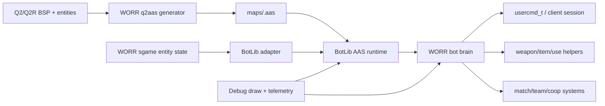

# Quake III Arena BotLib and Q2 AAS Port Plan

Date: 2026-06-16

Status: Planning / Backlog

Roadmap tasks: `FR-04-T01` through `FR-04-T07`, `FR-04-T10` through `FR-04-T16`, and `DV-07-T06`.

## Purpose

Elegantly port the Quake III Arena bot system into WORR by bringing across the useful architecture, data formats, tooling, and behavior patterns while respecting WORR's Quake II Rerelease gameplay, server-game ownership, build layout, and documentation rules.

The port is not a blind file drop. The target is a maintained WORR bot stack with:

- A Quake II map aware AAS generator based on `TTimo/bspc`.
- A rehosted Q3A BotLib/AAS runtime behind a narrow WORR adapter.
- WORR-native fake-client, command, cvar, match, and debug integration.
- Q2/Q2R weapon, item, movement, team, and coop behavior layered above the imported navigation primitives.
- Full source credit, license, and provenance tracking for every upstream-derived file and concept.

## Source Baseline

Primary local source:

- Quake III Arena source tree: `E:\_SOURCE\_CODE\Quake-III-Arena-master`
- Q3A BotLib runtime: `E:\_SOURCE\_CODE\Quake-III-Arena-master\code\botlib`
- Q3A game bot behavior: `E:\_SOURCE\_CODE\Quake-III-Arena-master\code\game\g_bot.c`, `ai_main.c`, `ai_dmq3.c`, `ai_dmnet.c`, `ai_team.c`, `ai_chat.c`, `ai_cmd.c`, and related `be_ai_*.h` APIs.
- Q3A fake-client and BotLib import glue: `E:\_SOURCE\_CODE\Quake-III-Arena-master\code\server\sv_bot.c`
- Q3A BSPC/AAS generator lineage: `E:\_SOURCE\_CODE\Quake-III-Arena-master\code\bspc`

Required external tool baseline:

- `TTimo/bspc`: `https://github.com/TTimo/bspc`
- The repository describes itself as the Quake III Arena BSP-to-AAS compiler, is forked from `bnoordhuis/bspc`, includes Quake II BSP/map support files such as `l_bsp_q2.c`, `map_q2.c`, and `q2files.h`, and is licensed as GPL-2.0-or-later per its README/license.

Current WORR bot surface:

- `src/game/sgame/bots/bot_think.cpp` has empty `Bot_BeginFrame` and `Bot_EndFrame` stubs.
- `src/game/sgame/bots/bot_exports.cpp` already exposes bot action helpers for weapon selection, item use, trigger use, forced look direction, and pickup checks.
- `src/game/sgame/bots/bot_utils.cpp` already builds useful bot-facing entity state and registers players, monsters, items, traps, and movers through the game import API.
- `src/game/sgame/bots/bot_debug.cpp` already exercises engine-side navigation/debug imports through `Bot_MoveToPoint`, `Bot_FollowActor`, `GetPathToGoal`, and debug drawing.
- `src/game/sgame/client/client_session_service_impl.cpp` already marks bot clients with `SVF_BOT` and calls `Bot_BeginFrame`.
- `src/game/sgame/player/p_view.cpp` already calls `Bot_EndFrame`.

## Guiding Decisions

1. Port the architecture before the behavior. First make AAS generation, BotLib loading, entity updates, and bot input plumbing reliable; only then expand combat/team intelligence.

2. Keep Q3A code in a quarantine boundary. Upstream-derived C code should live in clearly named BotLib/tooling directories with minimal local edits, explicit wrappers, and retained license headers. WORR behavior should call into it through adapter APIs instead of spreading Q3 globals through `sgame`.

3. Build Q2-native behavior above Q3 primitives. Q3A's Area Awareness System, goal weights, movement results, character files, and team AI are valuable. Q3A's item IDs, weapons, powerups, game modes, VM trap model, and player movement assumptions need translation.

4. Make AAS a first-class build artifact. Bots must not depend on hand-authored waypoints. AAS generation should be reproducible, validated, and staged with `.install/basew` whenever maps/assets are packaged.

5. Use `sg_` for new server-game cvars. Existing imported `bot_*` debug names may be retained inside quarantined upstream compatibility layers, but new public WORR controls should use `sg_bot_*`.

6. Preserve credits continuously. Every phase has an explicit credit/provenance checklist. A task is not done until source attribution is updated.

## Q3A to WORR Difference Matrix

This project must treat game and architecture differences as first-order design input, not cleanup after the port.

| Area | Quake III Arena Assumption | WORR / Quake II Rerelease Reality | Porting Response |
|---|---|---|---|
| Game module architecture | Q3 game code calls engine traps from a VM-style boundary. | WORR `sgame` is native C++ and already has KEX/Q2R-style game imports. | Replace trap calls with a narrow BotLib adapter and keep imported globals quarantined. |
| Fake clients | Q3 server owns `SV_BotAllocateClient`, `NA_BOT`, and BotLib import setup. | WORR already has client session services, `SVF_BOT`, and match logic that distinguishes bots from humans. | Integrate through WORR session services, not by copying Q3 server slot code directly. |
| Movement physics | Q3 pmove, acceleration, jump, crouch, and weapon movement expectations. | Q2 movement, step heights, water movement, crouch behavior, ladders where supported, knockback, and Q2 weapon timing. | Translate route results into Q2 `usercmd_t` steering and tune AAS reachability to Q2 movement constants. |
| Map format | Q3 BSP plus Q3-oriented AAS generation. | Q2 IBSP38 maps, Q2R-era extensions/tolerance needs, `.pak`/`.pkz` staging under `basew`. | Tailor `TTimo/bspc` Q2 loaders and configs; validate BSPX/extra lump tolerance before runtime reliance. |
| Navigation data | Q3 maps generally expect prebuilt `.aas` for BotLib. | WORR must support Q2 maps without manual waypoint files. | Make `worr_q2aas` reproducible and package/generate AAS as part of the build/release workflow. |
| Entity model | Q3 `gentity_t`, `entityState_t`, item/powerup IDs, and event model. | WORR has Q2/KEX `gentity_t`, `gclient_t`, `sv` bot-facing state, monsters, traps, movers, and Q2 item IDs. | Build explicit entity-state translation and avoid direct struct reuse. |
| Weapons | Q3 weapons and ammo economy. | Q2 weapons, ammo, inventory items, expansion weapons, splash rules, BFG behavior, weapon switching helpers. | Create WORR weapon metadata and use existing bot export helpers instead of Q3 weapon IDs. |
| Items and goals | Q3 item config, weights, and arena item distribution. | Q2 pickups, armor tiers, powerups, keys/objectives in coop, flags/techs in team modes. | Keep the goal/weight concept but author Q2-specific item configs and filters. |
| Match modes | Q3 FFA, tournament, team, CTF assumptions. | WORR includes Q2/Q2R match states, map voting, mymap queue, warmup/intermission logic, and possible coop scope. | Integrate with existing match services and make bots opt into each mode deliberately. |
| Coop/NPC context | Q3 bot AI is multiplayer-arena focused. | WORR also has monsters/NPCs, campaign maps, triggers, doors, and coop progression needs. | Keep coop as a later phase with explicit follow/wait/lead/resource-sharing behavior. |
| Filesystem/assets | Q3 `baseq3`, `pk3`, botfiles, arenas, scripts. | WORR `basew`, `.install`, `pak0.pkz`, current asset packaging rules. | Adapt paths and staging; do not assume Q3 directory names survive publicly. |
| Build system | Q3 make/project files and old C assumptions. | WORR Meson, mixed C/C++20, warning cleanup, local `.install` staging. | Build imported C behind Meson object/static-library boundaries and document warning exceptions. |
| Debug rendering | Q3 debug lines/polygons through server/BotLib hooks. | WORR already has debug draw imports (`Draw_Line`, `Draw_Point`, `Draw_Bounds`, etc.). | Map Q3 debug primitives to WORR draw APIs and preserve developer cvar gates. |
| Protocol/networking | Q3 bot commands and client state are Q3-specific. | WORR must preserve legacy Q2 server/demo compatibility and avoid q2proto churn. | Keep bot control server-side; do not change protocol unless a separate task explicitly proves the need. |
| Licensing/provenance | Q3A and BSPC are GPL-family upstreams with historical file headers. | WORR also carries GPL-compatible lineage and local ZeniMax/WORR headers. | Maintain file-level source ledger, retain headers, and credit direct imports separately from inspirations. |

## Target Architecture

Target source layout, subject to adjustment during implementation:

- `tools/q2aas/`: WORR-tailored BSP-to-AAS generator derived from `TTimo/bspc`.
- `src/game/sgame/bots/q3a/`: imported or lightly wrapped Q3A BotLib runtime code, kept behind C-compatible adapter boundaries.
- `src/game/sgame/bots/botlib_adapter.*`: WORR import table, map load/unload, entity sync, trace/PVS/FS/memory/debug bridging.
- `src/game/sgame/bots/bot_brain.*`: WORR-native bot lifecycle, per-frame scheduling, goal selection, and usercmd generation.
- `src/game/sgame/bots/bot_nav.*`: AAS area lookup, route requests, movement steering, stuck recovery, and debug overlays.
- `src/game/sgame/bots/bot_combat.*`: weapon selection, aim, reaction, projectile prediction, ammo/resource use.
- `src/game/sgame/bots/bot_team.*`: TDM/CTF/duel/match role logic.
- `src/game/sgame/bots/bot_profiles.*`: character/profile loading and skill knobs.
- `docs-dev/plans/q3a-botlib-aas-port.md`: this project plan.
- `docs-dev/q3a-botlib-aas-credits.md`: source ledger and credit tracker, created in Phase 0 and updated with each import/adaptation.

## Task Board

Use these tasks as the maintainable checklist backbone. Status values should follow the roadmap states: `Backlog`, `Ready`, `In Progress`, `In Review`, `Blocked`, `Done`.

| ID | Status | Area | Priority | Depends On | Definition of Done |
|---|---|---|---|---|---|
| `FR-04-T01` | Ready | `sgame/bots` | P0 | none | MVP behavior scope is written, accepted, and mapped to Q3A/WORR boundaries. |
| `FR-04-T02` | Backlog | `sgame/bots` | P0 | `FR-04-T01`, `FR-04-T12`, `FR-04-T14` | `Bot_BeginFrame` and `Bot_EndFrame` produce stable bot usercmds with scheduling, perception, and debug hooks. |
| `FR-04-T03` | Backlog | `sgame/bots` | P1 | `FR-04-T02` | Bots select Q2/Q2R weapons, ammo, powerups, and inventory items through WORR helpers. |
| `FR-04-T04` | Backlog | `sgame/bots`, `sgame/match` | P1 | `FR-04-T02`, `FR-04-T15` | Bots understand supported team/objective modes and avoid sabotaging match flow. |
| `FR-04-T05` | Backlog | `tools/q2aas`, `sgame/bots` | P1 | `FR-04-T11`, `FR-04-T14` | Map-level nav diagnostics validate generated AAS, spawn routing, reachability, and common blockers. |
| `FR-04-T06` | Backlog | `sgame/match` | P1 | `FR-04-T02` | Tournament, vote, map queue, and scoreboard flows handle bot participants intentionally. |
| `FR-04-T07` | Backlog | `sgame/bots`, docs | P2 | `FR-04-T01` | Public bot cvars use `sg_bot_*`, have sane defaults, and are documented in dev/user docs as appropriate. |
| `FR-04-T10` | Ready | docs, provenance | P0 | none | Source audit, license notes, and credits ledger exist before code import starts. |
| `FR-04-T11` | Backlog | `tools/q2aas` | P0 | `FR-04-T10` | `TTimo/bspc` based Q2 AAS generator builds locally, accepts WORR/Q2R map inputs, and emits validated `.aas` files. |
| `FR-04-T12` | Backlog | `sgame/bots/q3a` | P0 | `FR-04-T10` | Q3A BotLib runtime compiles behind a WORR adapter and can load/unload generated AAS for the active map. |
| `FR-04-T13` | Backlog | `sgame/client`, `sgame/commands` | P0 | `FR-04-T01` | Bots can be added/removed through WORR commands without network-client hacks or stale session state. |
| `FR-04-T14` | Backlog | `sgame/bots/bot_nav` | P0 | `FR-04-T11`, `FR-04-T12`, `FR-04-T13` | A spawned bot can route, steer, recover from simple stalls, and reach item/position goals on reference maps. |
| `FR-04-T15` | Backlog | `sgame/bots/bot_brain` | P1 | `FR-04-T14` | Q3A behavior concepts are translated into Q2 item, weapon, combat, and mode decisions. |
| `FR-04-T16` | Backlog | packaging, validation | P1 | `FR-04-T11`, `FR-04-T14` | AAS assets/tooling are staged under `.install/`, smoke tested, and covered by release packaging checks. |
| `DV-03-T05` | Backlog | tests | P2 | `FR-04-T02` | Bot scenario tests cover spawn, navigation, combat, and objective behavior. |
| `DV-07-T06` | Ready | docs | P0 | none | Imported-source credit and provenance requirements are documented and checked before each bot PR/merge. |

## Checklist System

Every task above should be tracked with the same small checklist. If a task does not need one line, mark it `N/A` with a short reason in the implementation log.

- [ ] Scope and owner recorded in the roadmap or issue tracker.
- [ ] Upstream/source files and concepts inventoried.
- [ ] Credit ledger updated before code lands.
- [ ] License headers retained or rewritten only when legally and historically correct.
- [ ] Design notes added under `docs-dev/` for significant implementation choices.
- [ ] Code implemented behind the planned ownership boundary.
- [ ] Build validation run.
- [ ] Runtime validation run on at least one reference map.
- [ ] Debug/telemetry path verified.
- [ ] `.install/` staging impact checked if binaries, maps, AAS files, or packaged assets changed.
- [ ] User docs updated under `docs-user/` if new commands/cvars are exposed.
- [ ] Roadmap task status updated.

## Phase 0: Governance, Source Audit, and Credits

Primary tasks: `FR-04-T01`, `FR-04-T10`, `DV-07-T06`

Goal: define the project contract before importing code.

Checklist:

- [x] Create `docs-dev/q3a-botlib-aas-credits.md`.
- [ ] Record source repositories and local paths:
  - [ ] `E:\_SOURCE\_CODE\Quake-III-Arena-master`
  - [ ] `https://github.com/TTimo/bspc`
  - [ ] `https://github.com/bnoordhuis/bspc`
- [ ] Capture upstream commit IDs for any imported snapshots.
- [ ] Record every imported file with:
  - [ ] WORR destination path.
  - [ ] Upstream path.
  - [ ] Upstream commit hash.
  - [ ] Original copyright header.
  - [ ] License.
  - [ ] Local modifications summary.
  - [ ] Contributor/author names found through file headers and upstream git history.
- [ ] Verify GPL-2.0/GPL-2.0-or-later compatibility against WORR's current license obligations before code import.
- [ ] Decide whether Q3A BotLib code is copied into `src/game/sgame/bots/q3a/`, built as a static library, or built as an internal game-module object group.
- [ ] Decide whether `tools/q2aas/` is a copied source snapshot, a git subtree, or a documented vendored import.
- [ ] Write the MVP behavior slice for `FR-04-T01`:
  - [ ] Spawn and leave cleanly.
  - [ ] Load character/profile data.
  - [ ] Find AAS area near spawn.
  - [ ] Route to a visible item or roam goal.
  - [ ] Engage visible enemies with a basic weapon policy.
  - [ ] Recover from simple stuck states.
  - [ ] Participate in FFA/TDM scoring without breaking match flow.

Credits requirements:

- [ ] Retain id Software copyright notices on Q3A-derived source.
- [ ] Retain ZeniMax/WORR notices on existing WORR files.
- [ ] Credit `TTimo/bspc` as the BSP-to-AAS compiler baseline.
- [ ] Credit `bnoordhuis/bspc` as the fork lineage shown by `TTimo/bspc`.
- [ ] Credit individual upstream commit authors when file-level git history is imported.
- [ ] Add a "Modified for WORR" note to imported files only where local modifications are made.

Exit criteria:

- The project can import code without losing provenance.
- The roadmap has bot/AAS/credit tasks.
- No source files are copied before their credit ledger rows exist.

## Phase 1: Q2 AAS Generator Based on `TTimo/bspc`

Primary tasks: `FR-04-T11`, `FR-04-T16`

Goal: produce reliable AAS files from Quake II / Quake II Rerelease maps.

Recommended target:

- Tool name: `worr_q2aas` or `q2aas`.
- Source root: `tools/q2aas/`.
- Output: `maps/<mapname>.aas` staged into `.install/basew/` or packaged into `.install/basew/pak0.pkz` when appropriate.
- Development output and generated scratch files: `.tmp/q2aas/`.

Implementation checklist:

- [ ] Import or vendor the `TTimo/bspc` source baseline after Phase 0 credits are in place.
- [ ] Build a standalone local executable through Meson.
- [ ] Keep the Q2 loader path active:
  - [ ] `l_bsp_q2.c`
  - [ ] `l_bsp_q2.h`
  - [ ] `map_q2.c`
  - [ ] `q2files.h`
  - [ ] `textures.c`
- [ ] Remove or isolate unused Q1/HL/Sin/Q3 map loaders only after validating they are not needed by shared code.
- [ ] Add a WORR config preset, for example `tools/q2aas/cfg/worr_q2.cfg`.
- [ ] Define WORR player presence types:
  - [ ] Standing player bounds.
  - [ ] Crouched player bounds.
  - [ ] Swimming movement.
  - [ ] Optional large/NPC presence type if later shared with monster AI.
- [ ] Map Q2 contents/surface flags to AAS travel flags:
  - [ ] Solid/world clipping.
  - [ ] Water.
  - [ ] Slime/lava/hurt volumes.
  - [ ] Ladders if represented by map/entity metadata.
  - [ ] Slick/sky/nodraw/detail/translucent surfaces where relevant.
- [ ] Teach generator about Q2/Q2R map quirks:
  - [ ] IBSP38 header validation.
  - [ ] Rerelease/BSPX lump tolerance if present.
  - [ ] Pak/pkz map lookup from WORR's `basew` staging layout.
  - [ ] Entity lump parsing for doors, plats, teleporters, triggers, hurt volumes, and spawn/item points.
- [ ] Add reachability passes for:
  - [ ] Walk.
  - [ ] Step up/down.
  - [ ] Walk off ledges within controlled drop limits.
  - [ ] Jumps and barrier jumps tuned to Q2 movement.
  - [ ] Water entry/exit.
  - [ ] Elevators/plats/doors as conditional reachability.
  - [ ] Teleports.
  - [ ] Optional rocket-jump routes behind an explicit `sg_bot_allow_rocketjump` style setting.
- [ ] Add deterministic metadata to generated AAS:
  - [ ] Source BSP checksum.
  - [ ] Tool version.
  - [ ] Config hash.
  - [ ] Generation time or reproducible build mode decision.
- [ ] Add diagnostics:
  - [ ] AAS area count.
  - [ ] Reachability count by travel type.
  - [ ] Orphaned item/spawn count.
  - [ ] Unreachable high-value item report.
  - [ ] Door/elevator route report.

Reference map checklist:

- [ ] `q2dm1`: basic DM routing, weapon pickup, elevator/vertical movement.
- [ ] `q2dm2`: multi-level combat routing.
- [ ] `q2dm8` or another open map: long sightline and item timing checks.
- [ ] A CTF map: flag route and team objective reachability.
- [ ] A campaign map: coop progression and door/trigger issues.
- [ ] At least one map with water/lava/slime.

Exit criteria:

- `worr_q2aas -bsp2aas <map>.bsp -output .tmp/q2aas` succeeds on the reference set.
- Generated `.aas` files load in the runtime shell from Phase 2.
- AAS validation failures produce actionable diagnostics rather than silent bot failure.

## Phase 2: BotLib Runtime Rehost

Primary task: `FR-04-T12`

Goal: compile and initialize the Q3A BotLib/AAS runtime behind a WORR adapter.

Implementation checklist:

- [ ] Create an imported-code boundary for Q3A BotLib files.
- [ ] Compile the BotLib C files with first-party warning policy decisions documented.
- [ ] Build a WORR-facing adapter for the Q3A `botlib_import_t` callbacks:
  - [ ] `Print` to WORR logging.
  - [ ] `Trace` to `gi.trace` / WORR collision.
  - [ ] `EntityTrace` to WORR entity clipping where available.
  - [ ] `PointContents` to WORR point contents.
  - [ ] `inPVS` to WORR PVS/area visibility.
  - [ ] `BSPEntityData` to active map entity lump access.
  - [ ] `BSPModelMinsMaxsOrigin` to inline model bounds.
  - [ ] `BotClientCommand` to a safe sgame command path.
  - [ ] Memory allocation to WORR zone/hunk or a bot-owned allocator.
  - [ ] Filesystem reads through WORR FS and `basew` search paths.
  - [ ] Debug lines/polygons to WORR debug draw imports.
- [ ] Add map lifecycle:
  - [ ] Init BotLib once per game module load.
  - [ ] Load active map AAS on map start.
  - [ ] Update BotLib time each server frame.
  - [ ] Shutdown/unload cleanly on map restart, game unload, or dedicated server exit.
- [ ] Add `sg_bot_enable` gate.
- [ ] Add developer/debug gates:
  - [ ] `sg_bot_debug`
  - [ ] `sg_bot_debug_aas`
  - [ ] `sg_bot_debug_route`
  - [ ] `sg_bot_debug_goal`
- [ ] Decide which upstream `bot_*` libvars remain internal and document their mapping.

Exit criteria:

- BotLib setup/shutdown can run through repeated map changes without leaks or stale pointers.
- The runtime can load a generated `.aas` and answer simple area/reachability queries.
- Debug polygons/lines can render through WORR debug draw.

## Phase 3: Fake Clients, Commands, and Profiles

Primary task: `FR-04-T13`

Goal: make bots join/leave like intentional WORR participants.

Implementation checklist:

- [ ] Audit current bot slot creation in `client_session_service_impl.cpp`.
- [ ] Add commands:
  - [ ] `sg_bot_add [profile] [team]`
  - [ ] `sg_bot_remove <name|slot|all>`
  - [ ] `sg_bot_kick_all`
  - [ ] `sg_bot_list`
  - [ ] `sg_bot_min_players`
  - [ ] `sg_bot_reload_profiles`
- [ ] Add safeguards:
  - [ ] Respect maxclients.
  - [ ] Respect match mode team limits.
  - [ ] Do not count bots as humans for server population policies that already distinguish them.
  - [ ] Free bot clients cleanly on disconnect, map end, and mode changes.
- [ ] Add profile loading:
  - [ ] Start with Q3A-style character files as an import format.
  - [ ] Add WORR JSON or info-string profile format if that fits existing UI/tooling better.
  - [ ] Map profile fields to skill, reaction, aggression, aim error, preferred weapons, chat personality, team role, and movement style.
- [ ] Add initial profile assets under `assets/` only after credit/source ownership is clear.

Exit criteria:

- A server operator can add and remove a named bot without restarting the map.
- Bot profiles load deterministically.
- Bot names, skins, teams, score, deaths, and spectator state remain sane in match UI.

## Phase 4: Entity Sync, Perception, and Scheduling

Primary tasks: `FR-04-T02`, `FR-04-T14`

Goal: feed bots a coherent world model on a fixed budget.

Implementation checklist:

- [ ] Expand `Entity_UpdateState` coverage where needed:
  - [ ] Players.
  - [ ] Bots.
  - [ ] Spectators.
  - [ ] Monsters/NPCs.
  - [ ] Items/powerups/ammo.
  - [ ] Dropped weapons/items.
  - [ ] Traps/projectiles/hazards.
  - [ ] Doors/plats/movers.
  - [ ] Objectives/flags.
- [ ] Push entity updates into BotLib each frame or on a staggered schedule.
- [ ] Add bot blackboard state:
  - [ ] Current enemy.
  - [ ] Last seen enemy.
  - [ ] Heard/damaged-by events.
  - [ ] Current goal.
  - [ ] Route state.
  - [ ] Stuck timer.
  - [ ] Item reservation.
  - [ ] Team role.
- [ ] Use staggered expensive checks:
  - [ ] Visibility traces split across frames.
  - [ ] Item desirability updates split across bots.
  - [ ] Route recomputation rate limited.
  - [ ] Enemy memory decay instead of all-knowing target locks.
- [ ] Add fairness constraints:
  - [ ] Bots only aim at entities they could plausibly know.
  - [ ] Skill affects reaction and accuracy, not omniscience.
  - [ ] Item timers can be disabled or fuzzed through cvars.

Exit criteria:

- Eight bots can run the perception loop without large server frame spikes.
- Debug overlay can show a selected bot's enemy, route, goal, and known items.

## Phase 5: Navigation and Movement

Primary tasks: `FR-04-T02`, `FR-04-T05`, `FR-04-T14`

Goal: turn AAS route information into Quake II movement commands.

Implementation checklist:

- [ ] Map Q3A `bot_input_t` style output to WORR/Q2 `usercmd_t`.
- [ ] Implement movement states:
  - [ ] Ground steering.
  - [ ] Jump.
  - [ ] Crouch.
  - [ ] Swim.
  - [ ] Ladder if supported by map metadata.
  - [ ] Door/plat wait/use.
  - [ ] Teleporter traversal.
- [ ] Add steering smoothing:
  - [ ] Look-ahead route points.
  - [ ] Corner cutting where safe.
  - [ ] Velocity-aware aim direction.
  - [ ] Avoid jittering between adjacent areas.
- [ ] Add stuck recovery:
  - [ ] Repath.
  - [ ] Short dodge/back-off.
  - [ ] Goal blacklist cooldown.
  - [ ] Door/trigger retry.
  - [ ] Last-resort respawn/spectator handling only in debug or controlled modes.
- [ ] Add movement debug:
  - [ ] Current AAS area.
  - [ ] Route polyline.
  - [ ] Next reachability type.
  - [ ] Stuck reason.
  - [ ] Failed goal reason.

Exit criteria:

- Bots can move from spawn to several item goals on `q2dm1` without manual waypoints.
- Movement looks like Q2 player movement rather than a Q3 movement transplant.
- Failed navigation reports enough detail to fix the generator or runtime.

## Phase 6: Combat, Item Utility, and Inventory

Primary tasks: `FR-04-T03`, `FR-04-T15`

Goal: translate Q3A combat and item concepts into WORR/Q2 rules.

Implementation checklist:

- [ ] Build Q2 weapon metadata:
  - [ ] Blaster.
  - [ ] Shotgun.
  - [ ] Super shotgun.
  - [ ] Machinegun.
  - [ ] Chaingun.
  - [ ] Grenades.
  - [ ] Grenade launcher.
  - [ ] Rocket launcher.
  - [ ] Hyperblaster.
  - [ ] Railgun.
  - [ ] BFG.
  - [ ] Expansion/rerelease weapons where present.
- [ ] Implement weapon selection:
  - [ ] Range bands.
  - [ ] Ammo availability.
  - [ ] Splash safety.
  - [ ] Enemy armor/health estimate.
  - [ ] Self-damage risk.
  - [ ] Projectile leading.
- [ ] Implement aim model:
  - [ ] Skill-based reaction delay.
  - [ ] Skill-based tracking noise.
  - [ ] Burst/commit behavior.
  - [ ] FOV/perception limits.
  - [ ] No instant 180-degree perfect shots except explicit debug modes.
- [ ] Implement item utility:
  - [ ] Health.
  - [ ] Armor.
  - [ ] Ammo.
  - [ ] Weapons.
  - [ ] Quad/damage boosts.
  - [ ] Invulnerability/protection.
  - [ ] Invisibility.
  - [ ] Techs/runes/CTF items if enabled.
- [ ] Add item reservation to avoid every bot choosing the same pickup.
- [ ] Add inventory use through existing `Bot_UseItem`.

Exit criteria:

- Bots can duel a human or another bot without standing idle, fixating on useless items, or choosing impossible weapons.
- Skill levels are visibly different but fair.

## Phase 7: Team Modes, Match Flow, and Coop

Primary tasks: `FR-04-T04`, `FR-04-T06`, later coop extension tasks

Goal: make bots useful in WORR's supported multiplayer and eventually cooperative contexts.

Implementation checklist:

- [ ] FFA:
  - [ ] Roam, collect, engage.
  - [ ] Avoid spawn camping loops where possible.
- [ ] TDM:
  - [ ] Team-aware target selection.
  - [ ] Item role split.
  - [ ] Avoid friendly fire where rules require it.
- [ ] CTF:
  - [ ] Attack/defend/mid roles.
  - [ ] Flag carrier support.
  - [ ] Dropped flag response.
  - [ ] Base return priorities.
- [ ] Duel/tournament:
  - [ ] Bot queue/spectator handling.
  - [ ] Warmup behavior.
  - [ ] Map restart cleanup.
- [ ] Match tools:
  - [ ] Votes.
  - [ ] Map queue/mymap.
  - [ ] Scoreboard classification.
  - [ ] Intermission and reconnect cleanup.
- [ ] Coop later phase:
  - [ ] Follow/wait/lead commands.
  - [ ] Door/elevator cooperation.
  - [ ] Monster target sharing.
  - [ ] Resource sharing.
  - [ ] Anti-blocking behavior.

Exit criteria:

- Bots do not destabilize existing match state.
- Team bots pursue objectives without all selecting the same role.

## Phase 8: UX, Cvars, Debug, and Docs

Primary tasks: `FR-04-T07`, `DV-07-T04`, `DV-07-T06`

Goal: expose the feature in a way server operators and developers can understand.

Suggested public cvars:

- `sg_bot_enable`
- `sg_bot_min_players`
- `sg_bot_skill`
- `sg_bot_profile`
- `sg_bot_max_clients`
- `sg_bot_allow_chat`
- `sg_bot_allow_item_timers`
- `sg_bot_allow_rocketjump`
- `sg_bot_debug`
- `sg_bot_debug_aas`
- `sg_bot_debug_route`
- `sg_bot_debug_goal`
- `sg_bot_cpu_budget_ms`

Docs checklist:

- [ ] `docs-dev/q3a-botlib-aas-credits.md`: source and contributor credit ledger.
- [ ] `docs-dev/q3a-botlib-runtime-implementation-YYYY-MM-DD.md`: runtime implementation log.
- [ ] `docs-dev/q2-aas-generator-implementation-YYYY-MM-DD.md`: generator implementation log.
- [ ] `docs-user/bots.md` or equivalent user-facing page:
  - [ ] How to add/remove bots.
  - [ ] Recommended cvars.
  - [ ] Known limitations.
  - [ ] AAS generation/package behavior in practical language.
- [ ] Roadmap updated after each task reaches `Done`.

Exit criteria:

- Developers can diagnose bot/AAS failures without reading Q3A source first.
- Server operators can enable basic bots with a small set of documented commands/cvars.

## Phase 9: Validation, Performance, and Release Packaging

Primary tasks: `DV-03-T05`, `FR-04-T16`, `DV-05-T05`

Goal: keep bots shippable rather than "works on one map."

Validation checklist:

- [ ] Build:
  - [ ] Windows local build.
  - [ ] Linux CI build once CI coverage exists.
  - [ ] macOS CI build once CI coverage exists.
  - [ ] Dedicated server build.
- [ ] Tool:
  - [ ] `worr_q2aas` builds.
  - [ ] Reference maps generate AAS.
  - [ ] Invalid BSP inputs fail clearly.
  - [ ] AAS metadata matches source BSP checksum.
- [ ] Runtime smoke:
  - [ ] Start dedicated server on reference map.
  - [ ] Add one bot.
  - [ ] Add four bots.
  - [ ] Add eight bots.
  - [ ] Run 10 minutes without crash.
  - [ ] Map change and repeat.
- [ ] Scenario tests:
  - [ ] Spawn and route to item.
  - [ ] Engage enemy.
  - [ ] Switch weapons.
  - [ ] Pick up health/armor.
  - [ ] Follow team objective.
  - [ ] Recover from blocked route.
- [ ] Performance:
  - [ ] CPU cost per bot.
  - [ ] Route recomputation rate.
  - [ ] Visibility trace count.
  - [ ] Memory used by AAS.
  - [ ] High bot count degradation policy.
- [ ] Packaging:
  - [ ] `.install/` refreshed after build.
  - [ ] Generated AAS included or intentionally generated on demand.
  - [ ] Tool binary included only if release policy allows it.
  - [ ] Credit/license files included with distributed source/binaries.

Exit criteria:

- Bots and generated AAS survive normal release packaging and smoke testing.
- Known map failures are tracked with diagnostics, not rediscovered manually.

## Credit and Attribution Policy

The project must maintain full credits as work proceeds. The minimum bar is:

- Preserve original source headers in imported Q3A/BSPC files.
- Add local modification notes with date and scope when files are edited.
- Maintain a source ledger under `docs-dev/`.
- Include `TTimo/bspc`, `bnoordhuis/bspc`, id Software, and file-level contributors discovered from upstream history.
- Keep the ledger updated in the same PR/commit as any imported or substantially adapted file.
- Do not collapse "inspired by" and "copied from" into one bucket. The ledger must distinguish:
  - Direct source import.
  - Heavily modified source derivative.
  - Algorithm/concept reference.
  - Clean WORR-native implementation.
- For external source snapshots, record exact commit hashes and retrieval date.
- For vendored code, include license text in the distributed source tree and release packaging where required.

Recommended ledger columns:

| WORR Path | Upstream Path/URL | Upstream Commit | Use Type | License | Copyright/Header | Contributors | Local Changes | Verification |
|---|---|---|---|---|---|---|---|---|

## Risks and Mitigations

| Risk | Impact | Mitigation |
|---|---|---|
| Q3A BotLib assumes Q3 movement and item rules. | Bots route or fight poorly in Q2 maps. | Treat BotLib as nav/goal infrastructure and build WORR-native Q2 behavior above it. |
| AAS generation fails on Q2R/BSPX map variants. | Bots cannot navigate affected maps. | Add tolerant BSP parsing, checksum metadata, and map-specific diagnostics in Phase 1. |
| Mover/door/elevator reachability is inaccurate. | Bots get stuck in common maps. | Model movers from entity lump and add runtime conditional reachability/stuck recovery. |
| Imported C code spreads globals into sgame. | Long-term maintainability suffers. | Keep imported code quarantined behind adapter APIs. |
| License/provenance is incomplete. | Legal and community trust risk. | Make credit ledger a Definition of Done item for every task. |
| High bot counts spike server frames. | Server performance regression. | Stagger expensive work, add CPU budgets, add perf telemetry before polish. |
| Bots feel unfair. | Poor player experience. | Use perception, reaction, aim noise, and item timer fairness gates. |
| Packaging misses AAS/tool files. | Release works locally but not for users. | Tie `.install/` and package validation into `FR-04-T16`. |

## Final Acceptance Criteria

The Q3A bot port is complete when:

- `worr_q2aas` or equivalent can generate usable AAS for the supported reference map set.
- WORR can load generated AAS and initialize BotLib on map start.
- Bots can be added/removed during a running server.
- Bots can navigate, collect useful items, fight, and recover from common route failures.
- Bots participate correctly in FFA/TDM/CTF and do not break match/vote/map transition flows.
- All new public cvars use `sg_bot_*` unless explicitly documented as imported compatibility controls.
- `.install/` staging and packaging include all required bot/AAS artifacts or a documented generation path.
- Credits, license files, source provenance, implementation logs, user docs, and roadmap task statuses are current.
